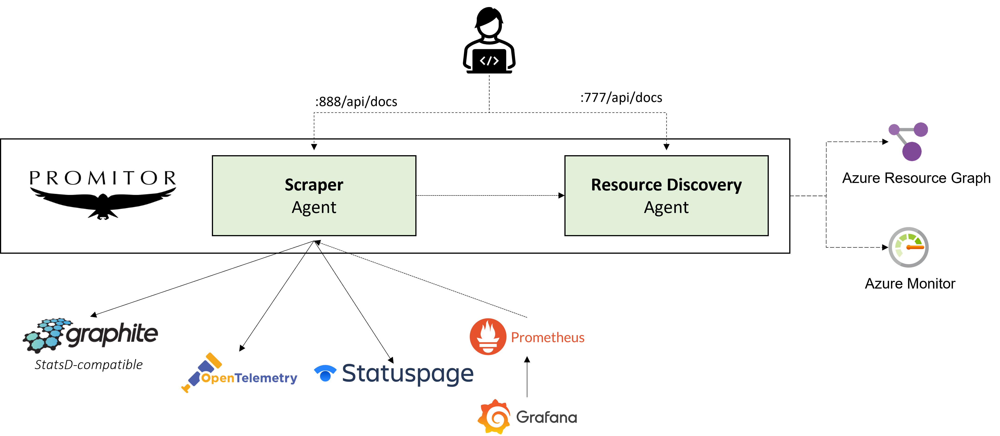
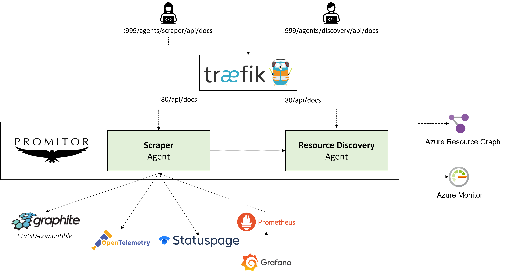

# Contributing to Promitor

This guide explains the layout of the Promitor repository, along with the tools
and technologies required to develop Promitor.

## Repository Structure

The promitor repository is made up of a number of different directories:

- `/` - contains documentation about the repository including the main README file
  and some configuration files for various tools used for development.
- `/.github` - contains github specific files including issue and PR templates.
- `/.vscode` - contains shared configuration files for [VS Code](https://code.visualstudio.com/).
- `/build` - contains the configuration files for Promitor's CI process.
- `/changelog` - contains the source code for building <https://changelog.promitor.io>
- `/config` - contains the configuration to run Promitor locally or in the CI
- `/deploy` - contains the automation that is being used to manage Promitor, such
  as the automated updates concerning new Docker images in a pull request.
- `/media` - contains all media such as images and sources of schematics used in the docs
- `/src` - contains the .NET source code for the Promitor application.

## Local Landscape

You can easily run Promitor locally through Docker Compose and interact with the various APIs & products:



### Using Traefik as a reverse-proxy

If you want to use Traefik as a reverse-proxy, here is how it is currently setup in Docker Compose:



## Helm Chart

The code for Promitor's Helm chart can be found on [promitor/charts](https://github.com/promitor/charts) which is also
 hosting the Helm chart registry.

## Documentation

The documentation for Promitor is hosted on [docs.promitor.io](https://docs.promitor.io) and is maintained in [promitor/docs](https://github.com/promitor/docs).

When adding new functionality to Promitor or modifying existing functionality, please add associated documentation.

Information about how to build and run the documentation locally can be found in
the [contribution guide]([docs/README.md](https://github.com/promitor/docs/blob/main/CONTRIBUTING.md)) for the documentation.

Every PR will automatically build and deploy a preview version of the documentation for you.

## Changelog

All changes to Promitor are listed on [our changelog](https://changelog.promitor.io/) so that end-users can keep track
 of changes per version over time.

Every PR should document what has changed by adding an entry to our changelog located in `changelog\content\experimental\unreleased.md`.

You can find some markup examples in `unreleased.md.template`, but every PR will automatically render a preview to make
 it easier for you.

## .NET Development

Promitor is written in C# using .NET Core. To make changes to Promitor you need the
following tools:

- [.NET Core SDK](https://dotnet.microsoft.com/download).
- Visual Studio 2017+, or an alternative editor like VS Code.

The C# code for Promitor can be found in the `/src` folder in the repository. The
Promitor code is split into multiple projects by functionality, with the following
projects worth highlighting:

- Promitor.Agents.Scraper - contains the main console application that runs Promitor.
- Promitor.Tests.Unit - contains the XUnit unit tests.
- Promitor.Docker - contains a Visual Studio Docker project for running Promitor
  during development.

### Visual Studio

If you are using Visual Studio, the solution file for Promitor is [src/Promitor.sln](src/Promitor.sln).

### Running Tests

To run the unit tests for Promitor, open a terminal and navigate to `src/Promitor.Tests.Unit`,
and run the following command:

```shell
dotnet test
```

If you want to perform TDD, you can use the `dotnet watch` command to watch for
changes and re-run the tests:

```shell
dotnet watch test
```

Alternatively, you can use the built-in tests runners in Visual Studio or whatever
tool you are using to edit the code.

#### Performance

Learn more about our performance tests [here](tests/README.md).

### Running Promitor

To run Promitor, edit [src/docker-compose.override.yml](src/docker-compose.override.yml)
and set the following environment variables:

- `PROMITOR_AUTH_APPID` - the client Id of the service principal used to access the
  Azure Monitor API.
- `PROMITOR_AUTH_APPKEY` - your service principal secret.

Next, edit [config/promitor/scraper/metrics.yaml](config/promitor/scraper/metrics.yaml) and set the following
keys:

- `azureMetadata.tenantId` - your Azure tenant Id.
- `azureMetadata.subscriptionId` - your Azure subscription Id.
- `azureMetadata.resourceGroupName` - the default resource group to use if none
  is specified for a metric.

Configure at least one scraper under the `metrics` section and finally, run the
Promitor.Docker project.

You can find more information about how to configure Promitor [here](https://docs.promitor.io/configuration/v2.x/metrics/).

**NOTE:** Please make sure not to commit your changes to `docker-compose.override.yml`
or `metrics.yaml`. If you do, you may end up publishing your Azure credentials
by accident.

## Docker

To build the Docker image, run the following command from the `/src` directory:

```shell
docker build . --file .\Promitor.Agents.Scraper\Dockerfile.linux --tag local/promitor-agent-scraper --build-arg VERSION=2.0.0 --no-cache
```
