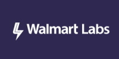

<!-- Because this file contains custom formatting for the heading, we need to
    disable some of the markdownlint rules -->
<!-- markdownlint-disable -->

<h1 align="center">Bringing Azure Monitor metrics where you need them.</h1>

    

**Promitor** is an Azure Monitor scraper which makes the metrics available through a scraping endpoint for Prometheus or push to a StatsD server.
<!-- markdownlint-enable -->

<!-- markdownlint-disable MD002 -->

## Documentation

All documentation is available on [promitor.io](https://promitor.io)

## Customers

We are proud to have the following customer(s) running Promitor in production:

Are you a Promitor user? Let us know and [get listed](https://forms.gle/hjcpaaVFa1A1hZaK6)!

## Contribution

All contribution guidelines can be found [here](./.github/CONTRIBUTING.md). We
welcome bug reports, improvement suggestions and pull requests.

Want to see support for a scraper that is not [already supported](https://promitor.io/configuration/v2.x/metrics/#supported-azure-services)?
You can contribute by [adding one yourself](adding-a-new-scraper.md)!

Information about making changes to Promitor can be found [here](development-guide.md).

## Support

Learn more about our support options [here](https://github.com/tomkerkhove/promitor/blob/master/SUPPORT.md).

Thanks for those who are supporting us via [GitHub Sponsors](https://github.com/sponsors/tomkerkhove/).

## Security

Learn more about our security policy [here](https://github.com/tomkerkhove/promitor/security/policy).

## Donate

Promitor is fully OSS and built free-of-charge, however, if you appreciate my work
you can do a small donation.

## Get in touch

Do you have a security issue to report or just want to privately contact me? Feel
free to [write me an email](mailto:kerkhove.tom@gmail.com) or [get listed as a user](https://forms.gle/hjcpaaVFa1A1hZaK6).

## Thank you

We'd like to thank all the services, tooling & NuGet packages that support us -
 [Thank you](https://promitor.io/thank-you)!

## License Information

This is licensed under The MIT License (MIT). Which means that you can use, copy,
modify, merge, publish, distribute, sublicense, and/or sell copies of the web
application. But you always need to state that Tom Kerkhove is the original author
of this web application.
