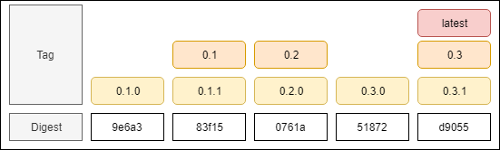

# Deployment

Here is an overview of the Promitor agents you can deploy:

- [Deploying Promitor Scraper](scraper/)
- [Deploying Promitor Resource Discovery](resource-discovery/)

## Image Tagging Strategy

Depending on your scenario you might need a different update cadence for Docker dependencies.

We provide a few options by offering multiple Docker tags:

- **latest** - Ideal for experimentation and proof-of-concepts, but not recommended
  for running production workloads.
- **{major}.{minor}** - Representation of a specific feature set, but will be
  updated with feature & security patches.
- **{major}.{minor}.{patch}** - Run a specific version of the runtime.
_(Alternative could be to use [image digest pinning](https://docs.docker.com/engine/reference/commandline/pull/#pull-an-image-by-digest-immutable-identifier))_

**All of the above tags are available for Linux. Every tag can be suffixed with
 `-linux` or `-windows` to target a specific OS.**

You can also pin to a specific digest of an image to ensure that you are running
the same image across your infrastructure. However, you will not receive security
patches unless you use a tool like [Renovate to keep them up-to-date](https://renovatebot.com/blog/docker-mutable-tags).

[&larr; back](/)
