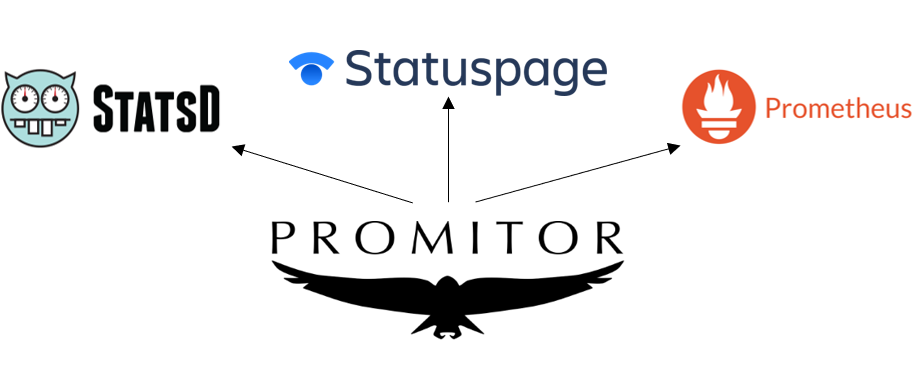
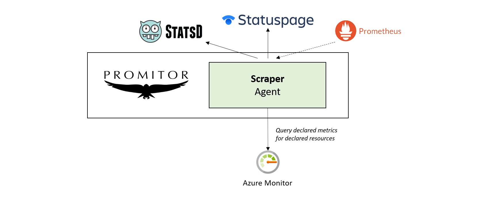
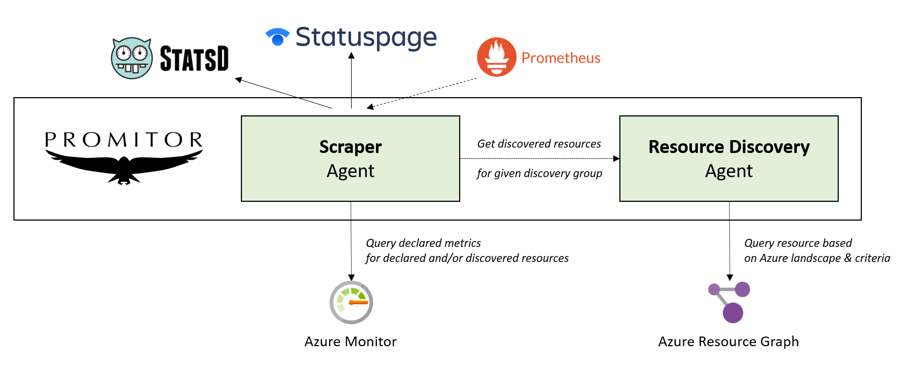
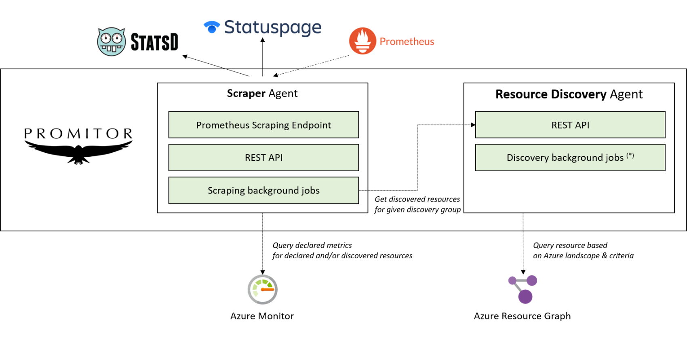

## How it works

**Promitor** is an Azure Monitor scraper which makes the metrics available
to a variety of metric systems such as Atlassian Statuspage, Prometheus and StatsD.

{: .center}

## Scraping Azure Monitor metrics

When you want to scrape resources, you can use **Promitor Scraper** which uses a metrics-as-code approach.

By writing a metric declaration, you will define what Azure Monitor metrics to scrape for a set of Azure resources and
 to what metric sink(s) they should be reported.

Here's an overview of how it works:

{: .center}

## Using resource discovery

While Promitor Scraper uses a declarative approach for defining Azure resources to scrape; as of Promitor Scraper 2.0
 you can integrate with **Promitor Resource Discovery**!

With resource discovery, you can define **resource discovery groups** that represent Azure resources of a given type and
 optionally define criteria for the resources to comply with.

By doing this, you can **change your metric declaration for Promitor Scraper so that,** instead of using declared resources,
 **reference a resource discovery group** which be used to determine what Azure resources it should scrape
 metrics for.

Behind the scenes, Promitor Resource Discovery integrates with **Azure Resource Graph** which will query your Azure landscape
 to discover the corresponding resources.

Here's an overview of how they work together:

{: .center}

You can easily start discovering resources automatically:

1. Declare resource discovery groups ([link](./../configuration/v2.x/resource-discovery))
2. Deploy Promitor Resource Discovery ([link](./../deployment/resource-discovery))
3. Configure Promitor Scraper to use resource discovery ([link](./../configuration/v2.x/runtime/scraper#using-resource-discovery))
4. Deploy Promitor Scraper ([link](./../deployment/scraper))

## What components do agents provide?

Every Promitor agent provides a REST API which which you can integrate and uses background jobs to acquire the data
 to reduce latency.

Here's a detailed overview:

{: .center}

_(*) Resources are still discovered synchronously but this will be implemented in Promitor Resource Discovery v0.2._

[&larr; back](/)
