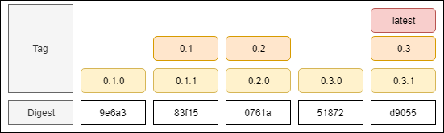

Here is an overview of how you can deploy Promitor on your infrastructure, we support both Linux and Windows.

_For more information about advanced configuration, read our documentation [here](/configuration)._

## Docker

```shell
❯ docker run -d -p 8999:80 --name promitor-agent-scraper \
                           --env PROMITOR_AUTH_APPID='<azure-ad-app-id>' \
                           --env-file C:/Promitor/az-mon-auth.creds \
                           --volume C:/Promitor/metrics-declaration.yaml:/config/metrics-declaration.yaml \
                           --volume C:/Promitor/runtime.yaml:/config/runtime.yaml \
                           tomkerkhove/promitor-agent-scraper:1.4.0
```

## Kubernetes

We provide a Helm Chart which deploys all the required infrastructure on your
Kubernetes cluster.

### Getting the Helm Chart

Install the Promitor Chart repository:

```shell
❯ helm repo add promitor https://promitor.azurecr.io/helm/v1/repo
```

If all goes well you should be able to list all Promitor charts:

```shell
❯ helm search hub promitor
URL                                                     CHART VERSION   APP VERSION     DESCRIPTION
https://hub.helm.sh/charts/promitor/promitor-ag...      1.4.0           1.4.0           A Helm chart to deploy Promitor, an Azure Monit...
https://hub.helm.sh/charts/promitor/promitor-ag...      0.0.0-PR920     0.0.0-PR920     A Helm chart to deploy Promitor, an Azure Monit...
```

### Using our Helm Chart

To use this, you will need to provide parameters [via `--set` or `--values`](https://helm.sh/docs/using_helm/#customizing-the-chart-before-installing).
Included here are the values that correspond with the local environment variables.
In addition to these, you will need a metric declaration file as described in
[Metric Declaration](/configuration/metrics).

```yaml
azureMetadata:
  tenantId: "<azure-tenant-id>"
  subscriptionId: "<azure-subscription-id>"

runtime:
  metricSinks:
    statsd:
      host: graphite
      port: 8125
      metricPrefix: poc.promitor.
  prometheus:
    scrapeEndpointPath: /metrics
    enableMetricTimestamps: True
  telemetry:
    applicationInsights:
      enabled: True
      key: "<azure-app-insights-key>"

metrics:
  - name: promitor_demo_servicebusqueue_queue_size
    description: "Amount of active messages of the 'orders' queue (determined with ServiceBusQueue provider)"
    resourceType: ServiceBusQueue
    namespace: promitor-messaging
    queueName: orders
    azureMetricConfiguration:
      metricName: ActiveMessages
      aggregation:
        type: Average
```

Check the [full values file](https://github.com/tomkerkhove/promitor/blob/master/charts/promitor-agent-scraper/values.yaml)
to see all configurable values.

If you have a `metric-declaration.yaml` file, you can create a basic deployment
with this command:

```shell
❯ helm install --name promitor-agent-scraper promitor/promitor-agent-scraper \
               --set azureAuthentication.appId='<azure-ad-app-id>' \
               --set azureAuthentication.appKey='<azure-ad-app-key>' \
               --values /path/to/helm-configuration.yaml
```

## Image Tagging Strategy

Depending on your scenario you might need a different update cadence for Docker dependencies.

We provide a few options by offering multiple Docker tags:

- **latest** - Ideal for experimentation and proof-of-concepts, but not recommended
  for running production workloads.
- **{major}.{minor}** - Representation of a specific feature set, but will be
  updated with feature & security patches.
- **{major}.{minor}.{patch}** - Run a specific version of the runtime.
_(Alternative could be to use [image digest pinning](https://docs.docker.com/engine/reference/commandline/pull/#pull-an-image-by-digest-immutable-identifier))_



**All of the above tags are available for Linux. Every tag can be suffixed with
 `-linux` or `-windows` to target a specific OS.**

You can also pin to a specific digest of an image to ensure that you are running
the same image across your infrastructure. However, you will not receive security
patches unless you use a tool like [Renovate to keep them up-to-date](https://renovatebot.com/blog/docker-mutable-tags).

[&larr; back](/)
