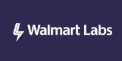

[](https://github.com/tomkerkhove/promitor/blob/master/LICENSE)
[](https://dev.azure.com/tomkerkhove/Promitor/_build/latest?definitionId=50&branchName=master)
[](https://hub.docker.com/r/tomkerkhove/promitor-agent-scraper/)
[](https://hub.docker.com/r/tomkerkhove/promitor-agent-scraper/)[](https://github.com/users/tomkerkhove/sponsorship)

**Promitor** is an **Azure Monitor scraper for Prometheus** providing a scraping
endpoint for Prometheus that provides a configured subset of Azure Monitor metrics.

{:refdef: style="text-align: center;"}

{: refdef}

## Running Promitor Scraper

Running Promitor Scraper is super easy:

```shell
docker run -d -p 8999:80 --name promitor-agent-scraper \
                         --env PROMITOR_AUTH_APPID='<azure-ad-app-id>'   \
                         --env-file C:/Promitor/az-mon-auth.creds \
                         --volume C:/Promitor/metrics-declaration.yaml:/config/metrics-declaration.yaml \
                         --volume C:/Promitor/runtime-config.yaml:/config/runtime.yaml \
                         tomkerkhove/promitor-agent-scraper:1.0.0
```

Docker image is available on [Docker Hub](https://hub.docker.com/r/tomkerkhove/promitor-agent-scraper/).

## Features

- Provides scraping endpoint for Prometheus
- Automatically scrapes Azure Monitor metrics (single and multi-dimensional)
- Built-in support for a variety of Azure services ([overview](configuration/v1.x/metrics#supported-azure-services))
- Easy to declare metrics to scrape via YAML & APIs
- Easily deployable via Docker & Kubernetes
- Sends telemetry to container logs & Azure Application Insights
- Support for all Azure clouds

And there is more on the way - Check our [backlog](https://github.com/tomkerkhove/promitor/issues)
and vote for features!

## Documentation

- **Deployment**
  - [Running Promitor on Docker](deployment#docker)
  - [Running Promitor on Kubernetes](deployment#kubernetes)
  - [Image Tagging Strategy](deployment#image-tagging-strategy)
- **Metrics**
  - [General Declaration](configuration/v1.x/metrics)
  - [Supported Providers](configuration/v1.x/metrics#supported-azure-services)
  - [What labels do we provide?](metrics/labels)
- **Configuration**
  - [Authentication with Azure Monitor](configuration/v1.x/azure-monitor)
  - [Prometheus Scraping Endpoint](configuration/v1.x/runtime#prometheus-scraping-endpoint)
  - [Logging & External Providers](configuration/v1.x/runtime#telemetry)
  - [Runtime](configuration/v1.x/runtime)
- **Operations**
  - [Azure Resource Manager API - Consumption & Throttling](operations#azure-resource-manager-api---consumption--throttling)
  - [Configuration REST APIs](operations#configuration-rest-apis)
  - [Health](operations#health)
- **Walkthroughs**
  - [Deploying Promitor, Prometheus, and Grafana on an AKS Cluster](/walkthrough)
- [**Frequently asked questions (FAQs)**](/faq)

## Support

Promitor is actively maintained and developed with best-effort support.

We do welcome PRs that implement features from our backlog and are always happy
to help you incorporate Promitor in your infrastructure, but do not provide 24/7
support. Are you having issues or feature requests?

Feel free to [let us know](https://github.com/tomkerkhove/promitor/issues/new/choose)!

## Customers

We are proud to have the following customer(s) running Promitor in production:



## Thank you

We'd like to thank all the services, tooling & NuGet packages that support us -
[Thank you](thank-you)!

## License Information

This is licensed under The MIT License (MIT). Which means that you can use, copy,
modify, merge, publish, distribute, sublicense, and/or sell copies of the web application.
But you always need to state that Tom Kerkhove is the original author of this web
application.
